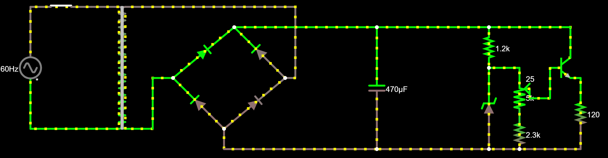

# **Projeto Fonte de Tensão**
--------
## **SCC0180 - Eletrônica para a Computação - Prof. Simões** [GitHub](https://github.com/simoesusp)
--------
# **Descrição:**
O projeto tem como objetivo a elaboração de uma fonte eletrôncia que seja capaz de a partir de uma tomada comum que possui tensão de 127V a 60 Hz, obter uma tensão que possa variar entre 3V-12V com uma corrente próxima a 100mA.
--------
## Print do circuito

--------
## Link para o [Falstad](https://www.falstad.com/circuit/circuitjs.html?cct=$+1+0.000005+16.817414165184545+58+5+43%0AT+-64+432+32+624+0+4+0.16+-0.26942041540056394+-0.08186327047633912+0.999%0Av+-160+432+-160+624+0+1+60+127+0+0+0.5%0Aw+-160+624+-64+624+0%0Ar+704+544+704+656+0+120%0Ad+64+544+160+464+2+default%0Ac+384+464+384+656+0+0.00047+17.790503338113144%0Ad+144+624+240+544+2+default%0Ad+144+624+64+544+2+default%0Ad+240+544+160+464+2+default%0Aw+496+656+384+656+0%0Aw+496+464+384+464+0%0As+-128+432+-96+432+0+0+false%0Aw+-128+432+-160+432+0%0Aw+-96+432+-64+432+0%0At+656+528+688+528+0+1+-4.895907608425027+0.7148036482860718+100%0Aw+688+464+688+512+0%0Aw+688+544+704+544+0%0Aw+704+656+608+656+0%0Aw+608+656+560+656+0%0A174+608+544+608+608+1+5000+0.005+Resistance%0Aw+656+576+624+576+0%0Aw+496+464+560+464+0%0Aw+656+528+656+576+0%0Ar+560+464+560+528+0+1200%0Aw+688+464+560+464+0%0A34+zvoltage%5Cq13+0+1.7143528192808883e-7+0+2+13%0Az+560+656+560+528+2+zvoltage%5Cq13%0Aw+560+656+496+656+0%0Aw+560+528+608+528+0%0Aw+608+544+608+528+0%0Ar+608+608+608+656+0+2300%0Aw+32+624+32+544+0%0Aw+32+544+64+544+0%0Aw+144+656+144+624+0%0Aw+32+432+256+432+0%0Aw+256+432+256+544+0%0Aw+256+544+240+544+0%0Aw+144+656+384+656+0%0Aw+160+464+384+464+0%0Ao+3+64+0+4099+20+0.2+0+2+3+3%0A)
--------
## Componentes do circuito
| **Componente** | **Justificativa** | 
|:---|---|
| Transformador | O transformador foi usado para modificar o nível de tensão de 127V CA para um valor próximo a 17V CA, dessa forma, obtemos uma tensão mais próxima de 3V-12V |
| 4 x Diodo | Os diodos foram usados para a formação de uma ponte retificadora(ponte de diodos), que tem como objetivo aproveitar o máximo do ciclo de tensão e, dessa forma, transformar a tensão de alternada para contínua |
| Capacitor | O objetivo do capacitor é armazenar carga, para durante as oscilações de tensão ele fornecer uma corrente necessária para manter o circuito em funcionamento |
| Diodo Zener | O diodo zener sendo um regulador de tensão, é utilizado para limitar a tensão que será obtida a partir dele, se a tensão de entrada for maior que a tensão zener, a tensão de saída será a tensão zener, caso contrário nada ocorrerá, logo, no projeto ele foi utilizado para prover ao circuito uma tensão final constante e proxima de 12V |
| Resistor 1.2KΩ | Este resistor foi utilizado para limitar a corrente que passará pelo diodo zener, visto que, quando ele estiver em funcionamento (com tensão de entrada superior a tensão zener) ele se tornará uma espécie de curto circuito, além disso, ele foi utilizado para garantir a menor perca possível de energia e também para limitar o valor da corrente de base do transistor NPN |
| Resistor 2.3KΩ | Este resistor ajuda limitar a tensão do potenciômetro, para garantir que exista uma tensão de pelo menos 3V fornecida ao transistor |
| Potenciômetro | Permite alternar a tensão de saída para um valor entre 3V-12V |
| Transistor NPN | O transistor NPN foi utilizado para de maneira mútua conseguir aproveitar a tensão de saída do potenciômetro (-0.7V entre a base e o emissor) com uma corrente amplificada e definida pelo produto da corrente de base com o ganho estático de corrente (beta ou hFE) |
--------
## Especificações e valores dos componentes
| **Componente** | **Especificações** | **Qtdade** | **Valor Unitário** |
|:---|---|---|---|
| Transformador | Bivolt 24V 1A | 1 | [R$34,99](https://www.magazineluiza.com.br/transformador-trafo-24-24v-1a-bivolt-mm/p/bha18aghhb/pi/auen/?&1=1&seller_id=hunion&&utm_source=google&utm_medium=pla&utm_campaign=&partner_id=54242&gclid=CjwKCAjwxev3BRBBEiwAiB_PWGVPDDHd4e99YbpvWCDPE95ZHM7fEwWpFrxrV3dTu8nvX6PwqdDZTRoCYycQAvD_BwE)| 
| Diodo | Modelo 1N4007 | 4 | [R$0,15](https://www.curtocircuito.com.br/diodo-retificador-1n4007-1000v-1a.html)| 
| Capacitor | Cap. eletrolítico 470uF/35V | 1 | [R$0,57](https://www.baudaeletronica.com.br/capacitor-eletrolitico-470uf-35v.html)| 
| Diodo Zener | Modelo 1N4743 (13V 1W) | 1 | [R$0,20](https://www.baudaeletronica.com.br/diodo-zener-1n4743-13v-1w.html)| 
| Resistor | 1.2KΩ | 1 | [R$0,08](https://www.baudaeletronica.com.br/resistor-1k2-5-1-4w.html)| 
| Resistor | 2.2KΩ + 100Ω = 2.3KΩ | 1 | [R$0,016](https://www.baudaeletronica.com.br/resistor-2k2-5-1-4w.html)| 
| Potenciômetro | 5kΩ | 1 | [R$1,09](https://www.baudaeletronica.com.br/potenciometro-linear-de-5k-5000.html)| 
| Transistor NPN | Modelo BC337 | 1 | [R$0,17](https://www.baudaeletronica.com.br/transistor-npn-bc337.html)| 
--------
## Projeto do esquemático
--------
## PCB no Eagle
--------
## **Desenvolvido por:**
Israel Felipe da Silva - Nro. USP: 11796531
